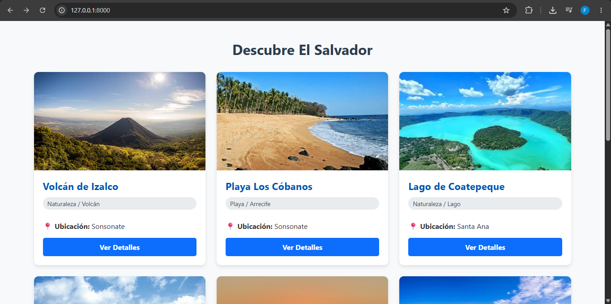
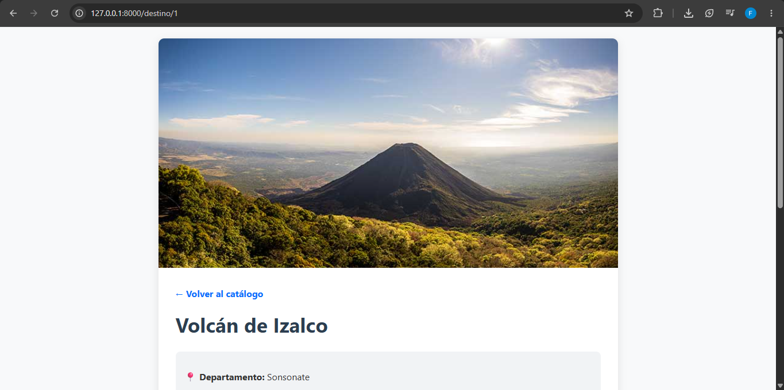
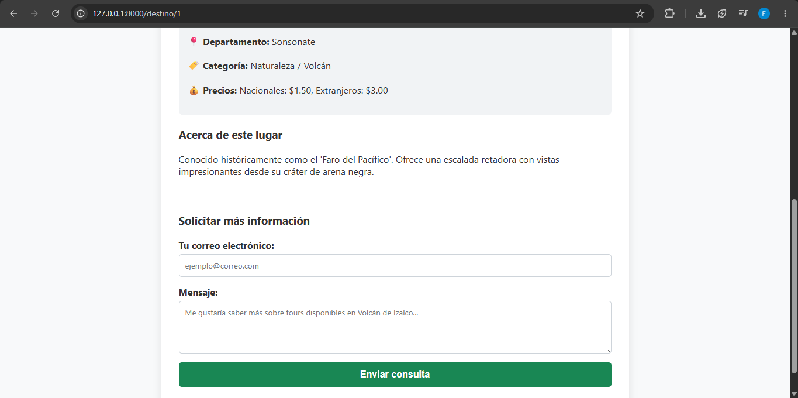

# Catálogo Turístico de El Salvador

Este es un catálogo web simple desarrollado en Laravel que muestra diversos lugares turísticos de El Salvador, utilizando archivos JSON como fuente de datos en lugar de una base de datos tradicional.

## Instrucciones de Instalación

Sigue estos pasos para levantar el proyecto en tu entorno local:

1. **Clonar el repositorio:**
   ```bash
   git clone [https://github.com/vxctorp12/catalogo-turistico-sv](https://github.com/vxctorp12/catalogo-turistico-sv)
   cd catalogo-turistico

2. Instalar dependencias de PHP:
composer install

3. Configurar el entorno:
Copia el archivo de ejemplo para crear tu propio archivo .env:
cp .env.example .env

# Nota: Si estás usando Windows, asegúrate de que la variable SESSION_DRIVER en el archivo .env esté configurada como SESSION_DRIVER=file para evitar errores con SQLite.

4. Generar la llave de aplicación:
php artisan key:generate

5. Levantar el servidor local:
php artisan serve


# DESCRIPCIÓN DEL FLUJO MVC IMPLEMENTADO

Modelo (Datos): En lugar de utilizar Eloquent y una base de datos relacional, la capa de datos es manejada por un archivo estático destinos.json ubicado en storage/app/.

Controlador (DestinoController): Actúa como intermediario. Lee el archivo JSON utilizando el Facade Storage (o file_get_contents), decodifica los datos en un arreglo asociativo y contiene la lógica para enviar la lista completa al catálogo o buscar un destino específico por su id para la vista de detalles.

Vista (Blade Templates): Reciben los datos procesados por el controlador. index.blade.php itera sobre el arreglo para generar las tarjetas del catálogo, mientras que show.blade.php renderiza la información detallada y el formulario de contacto de un lugar específico.

### Catálogo Principal


### Detalle del Destino

